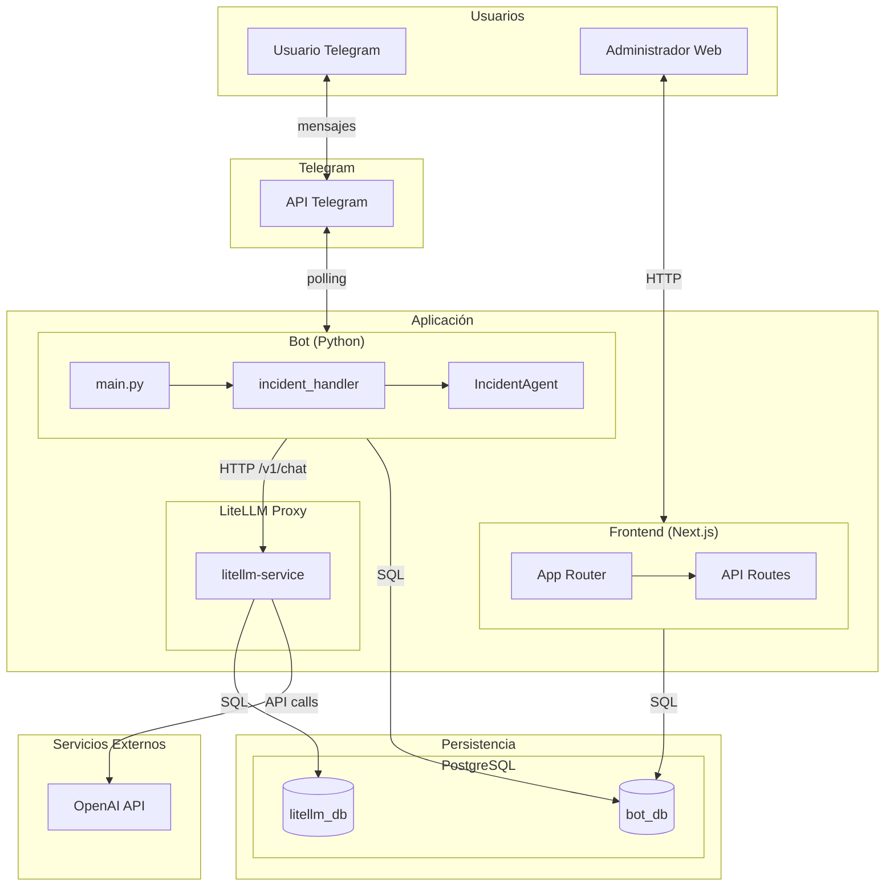

# Reporte de Incidentes

Sistema de reporte de incidentes laborales con agente de IA conversacional. Permite a los usuarios registrar incidentes mediante un bot de Telegram guiado por IA, y gestionarlos desde un panel web de administración.

## Características

- **Bot de Telegram**: Flujo conversacional guiado por IA para recolectar datos del incidente
- **Agente IA**: Genera preguntas empáticas, valida respuestas y resume reportes usando LLMs (OpenAI vía LiteLLM)
- **Panel de administración**: Dashboard web para consultar, filtrar y gestionar incidentes
- **Persistencia**: PostgreSQL con historial de conversaciones y almacenamiento de incidentes

---

## Diagrama de Arquitectura



### Flujo de datos

1. **Reporte de incidente**: Usuario → Telegram → Bot → LiteLLM → OpenAI → Bot → PostgreSQL
2. **Historial conversacional**: Bot persiste mensajes en `message_store` para contexto del LLM
3. **Administración**: Admin → Frontend → API Next.js → PostgreSQL
4. **LiteLLM**: Proxy que centraliza llamadas a OpenAI, gestiona claves y tracking de uso

---

## Stack tecnológico

| Componente | Tecnología |
|------------|------------|
| Bot | Python, python-telegram-bot, LangChain |
| IA / LLM | OpenAI (gpt-4o-mini), LiteLLM Proxy |
| Frontend | Next.js 14, React, Tailwind CSS |
| Autenticación | NextAuth.js (credenciales) |
| Base de datos | PostgreSQL 16 + pgvector |
| Infraestructura | Docker, Docker Compose |

---

## Estructura del proyecto

```
reporte-incidentes/
├── bot/                    # Bot de Telegram
│   ├── agent/              # Agente IA (LangChain, prompts)
│   ├── db/                 # Modelos y sesión SQLAlchemy
│   ├── handlers/           # Handlers de Telegram
│   ├── main.py
│   └── requirements.txt
├── frontend/               # Panel Next.js
│   ├── src/
│   │   ├── app/            # App Router, API routes
│   │   ├── components/
│   │   └── lib/            # auth, db
│   └── package.json
├── litemaas/               # Configuración LiteLLM
│   └── config.yaml
├── postgres/
│   └── init/               # Scripts de inicialización
│       ├── 01_extensions.sql
│       └── 02_tables.sql
├── docker-compose.yml
└── .env.example
```

---

## Requisitos previos

- [Docker](https://docs.docker.com/get-docker/) y Docker Compose
- Token de bot de Telegram ([@BotFather](https://t.me/BotFather))
- API Key de OpenAI

---

## Instalación

### 1. Clonar y configurar variables de entorno

```bash
git clone <repo-url>
cd reporte-incidentes
cp .env.example .env
```

### 2. Editar `.env`

| Variable | Descripción |
|----------|-------------|
| `BOT_POSTGRES_DB` | Base de datos del bot y frontend |
| `BOT_POSTGRES_USER` | Usuario PostgreSQL (bot/frontend) |
| `BOT_POSTGRES_PASSWORD` | Contraseña PostgreSQL |
| `LITEMAAS_POSTGRES_DB` | Base de datos LiteLLM |
| `LITEMAAS_POSTGRES_USER` | Usuario PostgreSQL LiteLLM |
| `LITEMAAS_POSTGRES_PASSWORD` | Contraseña LiteLLM |
| `LITELLM_MASTER_KEY` | Clave maestra para autenticar con LiteLLM |
| `OPENAI_API_KEY` | API Key de OpenAI |
| `TELEGRAM_BOT_TOKEN` | Token del bot de Telegram |
| `NEXTAUTH_SECRET` | Secreto NextAuth (ej: `openssl rand -base64 32`) |
| `ADMIN_EMAIL` | Email del administrador |
| `ADMIN_PASSWORD` | Contraseña del administrador |

### 3. Levantar los servicios

```bash
docker compose up -d
```

### 4. Verificar

- **Frontend**: http://localhost:3000
- **LiteLLM UI**: http://localhost:4000
- **PostgreSQL**: localhost:5432

---

## Uso

### Reportar un incidente (Telegram)

1. Busca tu bot en Telegram
2. Envía `/start`
3. Comparte tu número de teléfono cuando se solicite
4. Responde las preguntas guiadas (nombre, compañía, fecha, descripción, etc.)
5. Al finalizar recibirás un resumen y confirmación

### Gestionar incidentes (Panel web)

1. Accede a http://localhost:3000
2. Inicia sesión con `ADMIN_EMAIL` y `ADMIN_PASSWORD`
3. En el dashboard verás estadísticas y la tabla de incidentes
4. Filtra por clasificación (Seguridad, Salud, Medio ambiente) o estado

---

## Modelo de datos

### Tabla `incidents`

| Campo | Tipo | Descripción |
|-------|------|-------------|
| id | UUID | Identificador único |
| telegram_user_id | BIGINT | ID del usuario en Telegram |
| session_id | VARCHAR | Sesión de conversación |
| nombre, telefono | VARCHAR | Datos del reportante |
| nivel_organizacional | VARCHAR | Ejecutivo \| Supervisor \| Operador |
| compania | VARCHAR | Organización |
| fecha_evento, hora_aproximada | VARCHAR | Cuándo ocurrió |
| que_ocurrio, por_que_ocurrio, impacto | TEXT | Descripción |
| clasificacion_principal | VARCHAR | Seguridad \| Salud \| Medio ambiente |
| estado | VARCHAR | pendiente, etc. |

### Tabla `message_store`

Almacena el historial de mensajes por sesión para dar contexto al agente IA (formato LangChain PostgresChatMessageHistory).

---

## Licencia

Proyecto de portafolio.
